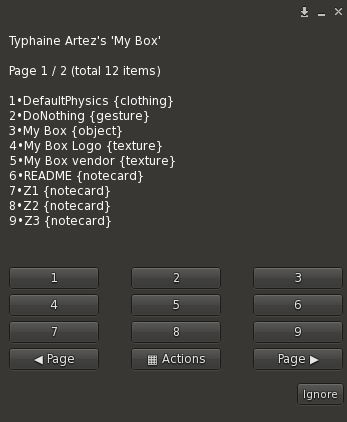

# My Box

List box content via a dialog, with rez option. Drop the `MyBox` script in an object containing things.

The script will tell to you (only to you) how many items are in object inventory. It will do each time the inventory content changes.

> Good to know: you can drop anything in your objects by dragging items from your inventory to the object, holding the `Ctrl` key (or `Cmd` on MAC).

## Listing

Click the object to get a dialog listing all items in the object:

The dialog indicates the total number of items and handles multiple pages (use `◀ Page` and `Page ▶` to navigate through pages). The content is sorted alphabetically and numbered. For each item, you get its type among the following:

Type | Description
-----|------------
`{animation}` | animation
`{clothing}` | system clothes, including alpha and physics
`{gesture}`  | gestures
`{landmark}` | landmarks
`{notecard}` | notecards
`{object}`   | objects
`{script}`   | scripts (except MyBox script itself)
`{sound}`    | sound
`{texture}`  | texture or photo

## Item actions

Clicking on a number button opens a new dialog with actions to take for this item, as well as its type and permissions information about it.

Depending on its type, several options are available:

Button | Description | Only for
-------|-------------|---------
Get Copy | Copy the item in your inventory (if permission is no-copy, transfer it instead) |
Animate | Send a permission request to animate your avatar with this animation during 60 secondes | `{animation}`
Rez | Rez the item to the ground, at 2 meters far in container object direction and 1 meter high. You are responsible to delete the rezzed object. | `{object}`
Show | Show the texture on face `0` of the object (a *MyBox* texture is set back when returning to the listing dialog) | `{texture}`
Play | Play the sound | `{sound}`
Delete | Delete item from object inventory |
Back | Return to listing dialog |

## Global actions

The `▦ Actions` button brings a dialog giving actions to perform in the whole content of the object:

Button | Description
-------|------------
Copy All | Copy all the items (without `MyBox` script) in your inventory in a folder named by the name of the object (**Warning**: if the object contains no-copy items, the whole copy will fail silently)
Delete All | Delete all items from the object (**Warning**: no confirmation asked - once you click the button, all content is deleted)
Delete Me | Delete **.MyBox** script from the object
Back | Return to the listing dialog
